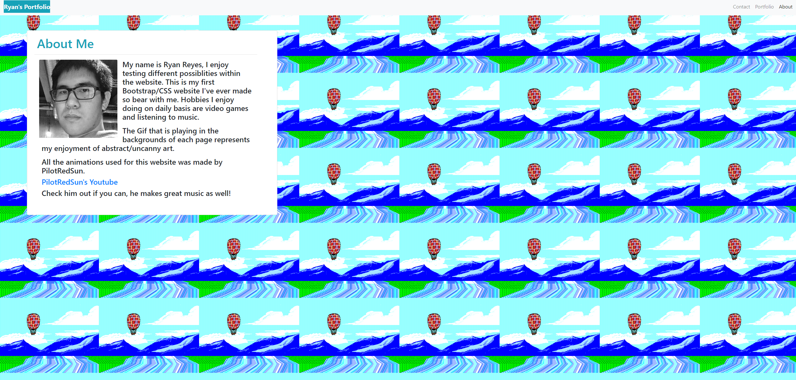
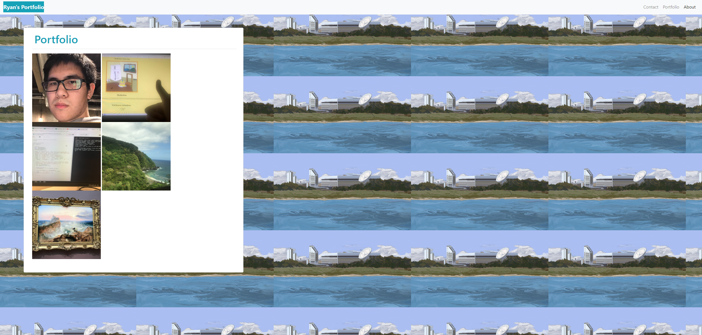
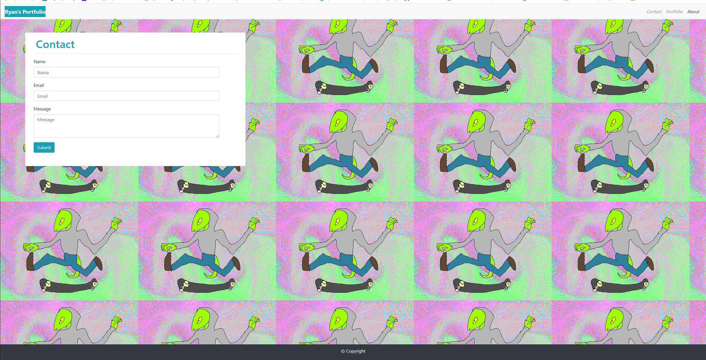
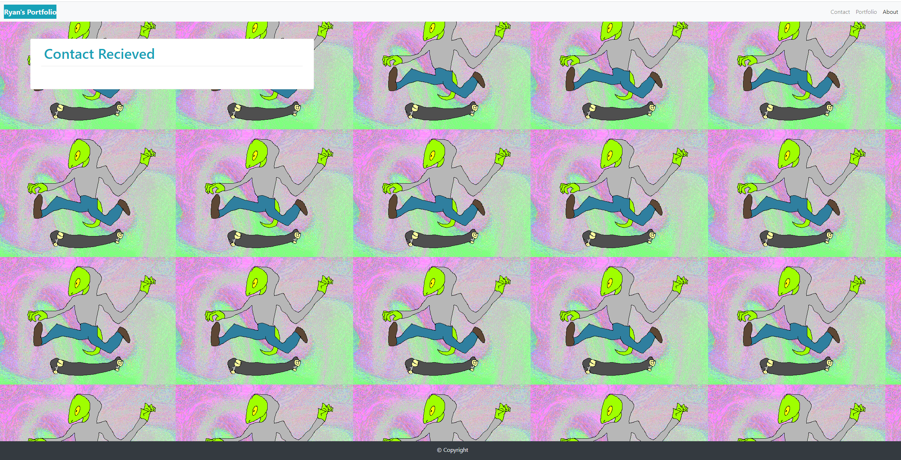

# HW2
My First CSS &amp; Bootstrap Website

## Assignment

Goal is to create a website using CSS and Bootstrap.
* Must use working Bootstrap Columns 
* Follow the images given 
* Must Use
        * A Navbar
        * A Responsive Layout
        * Images
        
        
### Links 

Navbar Tabs/ Buttons
* Ryan's portfolio allows them to go to the main page which is the "About" site
* The About tab leads to About tab
* Clicking Contacts takes you to the Contacts Site
* Clicking Portfolio will send you to the Portfolio Site
* If you go to Contacts and click submit, it will lead you to another website that completes your submission

#### Note: Some Sites have GIF backgrounds
